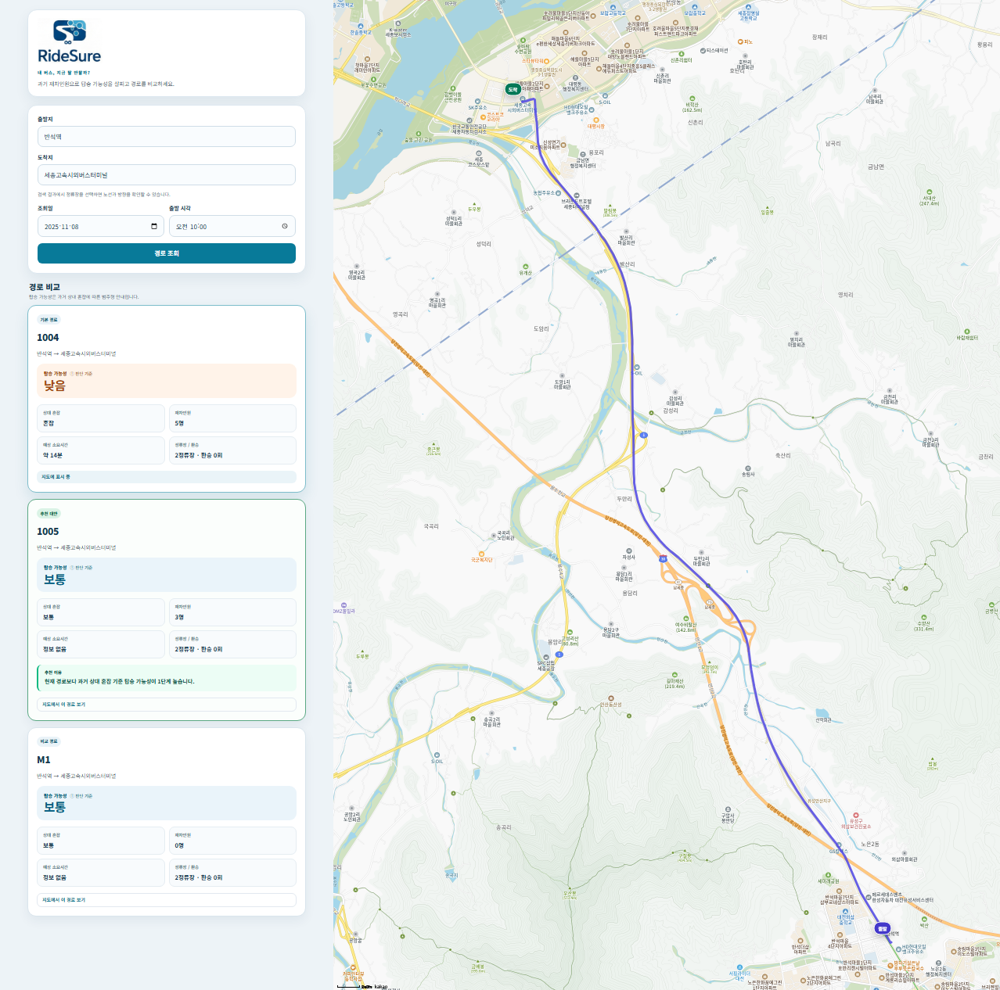
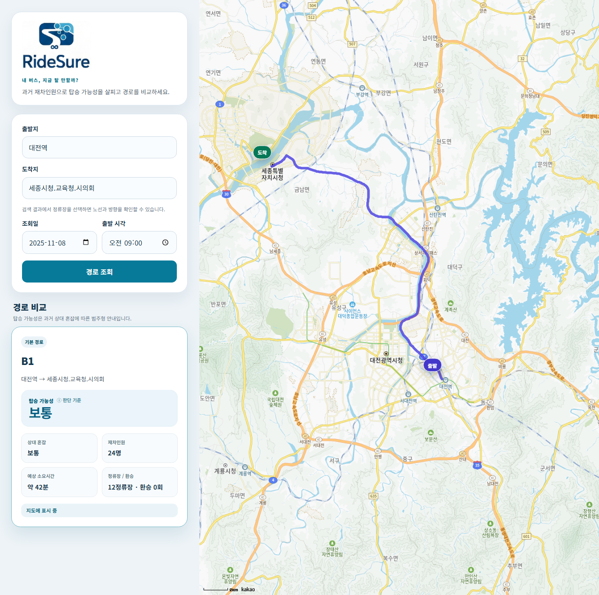
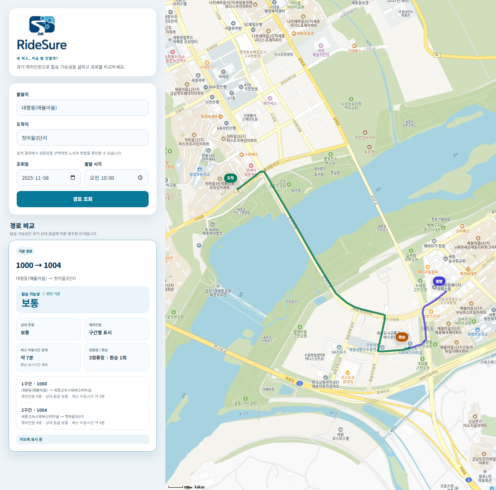

# RideSure

**과거 버스 재차인원을 바탕으로 탑승 가능성을 판단하고, 현재 경로와 대안을 비교하는 대중교통 프로토타입**

> **이번 버스를 타도 될까?**
>
> RideSure는 버스 이용자가 경로만 확인하는 것을 넘어, 과거 재차인원에 따른 탑승 여유를 함께 판단할 수 있도록 만든 서비스입니다.  
> 탑승 가능성, 상대 혼잡, 재차인원, 예상 이동시간을 보여주고, 현재 경로보다 탑승 여유가 높은 후보가 있으면 대안을 제시합니다.

현재 버전은 **2025-11-08 historical 차내 재차인원 snapshot**을 사용하는 포트폴리오 데모입니다. 실시간 교통 서비스가 아니며, 탑승 가능성은 실제 승차 성공 확률이 아닌 과거 재차인원의 상대 혼잡 수준을 바탕으로 한 범주형 판단입니다.

---

## Demo

### 탑승 가능성에 따른 대안 추천



`반석역 → 세종고속시외버스터미널`, 2025-11-08 10:00 기준 실제 데모에서는 기본 경로 `1004`의 탑승 가능성이 **낮음**, 대안 `1005`가 **보통**으로 판단되어 대안을 추천합니다.

추천은 단순 노선명 비교가 아니라 각 후보의 과거 재차인원 근거와 탑승 가능성 수준을 비교해 결정합니다.

### B1 기본 경로



`대전역 → 세종시청.교육청.시의회`, 09:00 기준:

- 탑승 가능성: **보통**
- 상대 혼잡: **보통**
- 재차인원: **24명**
- 예상 소요시간: **약 42분**
- 정류장 수: **12개**
- 환승: **0회**

### 1회 환승 경로



`대평동(해들마을) → 첫마을3단지` 경로에서는 `1000 → 1004`의 검증된 1회 환승 경로를 제공합니다.

전체 환승 여정 시간이 검증되지 않은 경우에는 버스 구간의 이동시간만 합산하며, 환승 대기시간을 임의로 추정하지 않습니다.

---

## 핵심 기능

### 1. 탑승 가능성 판단

과거 재차인원의 상대 혼잡 수준을 다음과 같이 사용자 관점의 판단으로 변환합니다.

| 상대 혼잡 | 탑승 가능성 |
| --- | --- |
| 여유 | 높음 |
| 보통 | 보통 |
| 혼잡 | 낮음 |
| 매우 혼잡 | 매우 낮음 |
| 데이터 부족 | 판단 불가 |

이 값은 **실제 탑승 확률이 아닙니다.**

`boarding_probability`는 항상 `null`로 유지하며, 근거 없이 70%, 80% 같은 확률을 생성하지 않습니다.

상대 혼잡 역시 차량 정원 대비 점유율이 아니라 동일한 historical observation 집합 안에서의 상대적 수준입니다.

### 2. 경로 비교와 대안 추천

RideSure는 직행 후보와 검증된 1회 환승 후보를 함께 비교합니다.

API의 `route_options`는 최대 3개의 의미 있는 경로를 카드 형태로 제공합니다.

비교에 사용하는 근거는 다음과 같습니다.

1. 탑승 가능성
2. 상대 혼잡
3. 검증된 예상 이동시간
4. 환승 횟수
5. 정류장 수

현재 경로의 탑승 가능성이 낮음 또는 매우 낮음이고, 근거가 있는 다른 후보가 한 단계 이상 더 좋은 경우 추천 대안으로 표시합니다.

같은 경로를 여러 태그로 중복 생성하지 않으며, 실제 근거가 없는 최소비용이나 최적 경로를 임의로 만들지 않습니다.

### 3. 정류장 자동완성

사용자가 정확한 정류장명을 외워 입력하지 않아도 되도록 정류장 검색 API를 연결했습니다.

- 부분 문자열 검색
- 자동완성 dropdown
- 방향키 이동
- Enter 선택
- 마우스 선택
- 선택 후 입력 변경 시 stale selection 해제

### 4. 예상 이동시간과 지도

노선 선택 자체는 RideSure와 Neo4j가 수행합니다.

Kakao 대중교통 응답에서 다음 조건이 일치하는 경우에만 경로 geometry와 시간을 사용합니다.

- BUS 노선명
- 승차 정류장
- 하차 정류장
- 검증된 출발 및 도착 좌표

직행 경로에서는 검증된 전체 이동시간을 표시합니다.

환승 경로의 전체 itinerary를 충분히 검증하지 못한 경우에는 각 BUS 구간의 이동시간만 사용하며 다음과 같이 구분합니다.

```text
버스 이동시간 합계 약 7분
환승 대기시간 제외
```

검증할 수 없는 geometry를 임의의 직선으로 연결하지 않습니다.

---

## 프로젝트 배경

RideSure는 **2025 DSC 공유대학 KT 기업연계 오픈데이터 활용 스타트업 챌린지**에서 시작했습니다.

대회 당시 문제는 B1 BRT 이용자가 버스가 도착하기 전 다음을 판단하기 어렵다는 것이었습니다.

```text
이번 버스를 탈 수 있을까?
얼마나 혼잡할까?
얼마나 걸릴까?
혼잡하다면 다른 경로는 없을까?
```

초기 MVP의 제품 목표는 다음 네 가지였습니다.

```text
혼잡도
→ 탑승 가능성
→ 예상 소요시간
→ 대안 경로
```

Neo4j, 재차인원 기반 안내, 로컬 EXAONE 설명, 지도 UI를 결합한 프로토타입을 만들었으며, 대회 이후 포트폴리오 재구성 과정에서 데이터 구조와 경로 검증 방식을 다시 설계했습니다.

현재 저장소의 재현 가능한 ETL, occurrence 기반 Knowledge Graph, 공식 정류장 검증, 1회 환승, Kakao BUS geometry, Decision Layer는 이 후속 재구성 결과입니다.

---

## Architecture

```text
Historical CSV
      │
      ▼
ETL / provenance
      │
      ▼
Neo4j Knowledge Graph
      │
      ├── RoutePattern
      ├── StopOccurrence
      ├── NEXT
      └── LoadObservation
      │
      ▼
Route Search
direct + verified one-transfer
      │
      ▼
Decision Layer
boarding likelihood + congestion
      │
      ├── route comparison
      └── alternative recommendation
      │
      ▼
FastAPI
      │
      ├── Kakao transit geometry / time
      └── optional EXAONE explanation
      │
      ▼
Web UI
```

EXAONE은 선택적 설명 계층입니다.

경로를 찾거나 혼잡 수치를 계산하지 않으며, 모델 서버가 없어도 구조화된 결과와 규칙 기반 안내가 정상적으로 동작합니다.

---

## Knowledge Graph 재설계

### 기존 식별자 문제

세 historical CSV는 총 **11,375행**이며 각 행에 24개 시간대 재차인원 값이 있습니다.

이를 시간 단위 observation으로 변환해 `LoadObservation` **273,000개**를 생성했습니다.

초기 v1 식별자를 분석한 결과:

- collision key: **83,688개**
- conflicting key: **33,650개**

정류장 이름과 시간만으로 observation을 식별하는 방식으로는 원본의 방향, 순서, 반복 방문을 안전하게 보존할 수 없었습니다.

### occurrence 단위 그래프

그래서 historical `Stop`과 특정 노선 패턴에서의 실제 방문 위치인 `StopOccurrence`를 분리했습니다.

```text
(Line)-[:HAS_PATTERN]->(RoutePattern)
(RoutePattern)-[:HAS_OCCURRENCE]->(StopOccurrence)
(StopOccurrence)-[:AT_STOP]->(Stop)
(StopOccurrence)-[:NEXT]->(StopOccurrence)

(LoadObservation)-[:OBSERVED_AT]->(StopOccurrence)
(LoadObservation)-[:ON_LINE]->(Line)
(LoadObservation)-[:IMPORTED_IN]->(ImportBatch)
```

v2 observation ID는 원본 파일 hash, 원본 행, hour를 기반으로 생성하며 provenance 정보를 유지합니다.

현재 historical graph:

| Entity | Count |
| --- | ---: |
| Line | 148 |
| RoutePattern | 154 |
| Stop | 2,049 |
| StopOccurrence | 11,375 |
| LoadObservation | 273,000 |
| ImportBatch | 3 |
| NEXT | 11,221 |

B1의 연속된 `오송역2.3.4` 두 방문도 서로 다른 occurrence로 보존됩니다.

---

## 공식 정류장 검증

Historical 데이터의 정류장명과 현재 TAGO 정류장을 이름만으로 합치지 않습니다.

다음 정보를 함께 확인한 경우에만 historical occurrence와 공식 물리 정류장을 연결합니다.

- 노선 ID
- 운행 방향
- 전체 정류장 순서
- 앞뒤 정류장 문맥

검증된 관계만:

```text
VERIFIED_OFFICIAL_STOP
```

으로 저장합니다.

### B1 검증 결과

- Historical occurrence: **53개**
- 현재 TAGO 정류장: **55개**
- 자동 검증: **41개**
- 사람 검토 후 추가 검증: **2개**
- 최종 검증: **43 / 53**
- 미해결: **10개**

근거가 부족한 occurrence는 강제로 매핑하지 않습니다.

---

## Routing

직행 경로는 historical `NEXT` 순서를 따라 조회합니다.

1회 환승은 서로 다른 `RoutePattern`의 occurrence가 **동일한 `VERIFIED_OFFICIAL_STOP`**에 연결된 경우에만 허용합니다.

예:

```text
대평동(해들마을)
→ 1000
→ 세종고속시외버스터미널
→ 1004
→ 첫마을3단지
```

지원하지 않는 방식:

- 이름 유사도만 이용한 환승
- 좌표가 가깝다는 이유만으로 연결
- 임의의 도보 환승
- 동일 패턴 내부 pseudo transfer
- 역방향 NEXT 탐색
- 2회 이상 환승

---

## Validation

Windows, Python 3.12, Docker Desktop, Neo4j 5.26 Community 환경에서 다음 clean-room 과정을 검증했습니다.

```text
fresh clone
→ 새 virtual environment
→ 빈 Neo4j volume
→ 저장소 CSV와 TAGO snapshot만 사용
→ 전체 graph 재구축
```

`python -m scripts.prepare_demo_data`

- 최초 구축: 약 **2분 10초**
- 동일 상태 재실행: 약 **34초**
- `RouteStopStaging`: **210**
- `VERIFIED_OFFICIAL_STOP`: **162**

실행 시간은 시스템 환경에 따라 달라질 수 있습니다.

### Integrity verification

```bash
python data_insert_v2.py verify
```

검증 결과:

```text
state = complete

incomplete batch = 0
invalid coordinate = 0
orphan = 0
provenance error = 0
sequence error = 0
```

### Tests

```bash
python -m pytest -q
```

현재 검증 결과:

```text
121 passed
9 subtests passed
```

브라우저에서는 다음 대표 시나리오를 직접 확인했습니다.

- B1 직행
- 1000 직행
- 1000 → 1004 1회 환승
- 1004 기본 경로 → 1005 추천 대안

---

## 데이터 범위와 한계

현재 데모에는 명확한 제한이 있습니다.

- 재차인원 기준 날짜는 **2025-11-08**입니다.
- 실시간 재차인원 importer는 구현하지 않았습니다.
- 탑승 가능성은 실제 확률이 아니라 relative congestion 기반 범주형 판단입니다.
- 차량 정원을 임의로 가정하지 않습니다.
- 무정차 확률을 생성하지 않습니다.
- 임의 날짜의 혼잡을 예측하지 않습니다.
- 도보 환승을 생성하지 않습니다.
- 2회 이상 환승을 지원하지 않습니다.
- 환승 대기시간을 임의로 추정하지 않습니다.
- 검증된 Kakao 시간이 없으면 예상 시간을 비워 둡니다.
- 공식 정류장 매핑이 없는 historical occurrence는 지도 좌표가 없을 수 있습니다.
- 추천은 상용 지도 서비스 수준의 최적 경로 판정이 아닙니다.

데이터가 부족한 경우 값을 만들어내지 않고 `UNKNOWN / 데이터 부족`으로 남깁니다.

---

## Quick Start

### Requirements

- Python 3.12
- Docker Desktop
- Neo4j 5.26 Community
- Kakao JavaScript key
- Kakao REST API key

EXAONE, GPU, `DATA_GO_KR_SERVICE_KEY`는 기본 데모 실행에 필요하지 않습니다.

### Windows PowerShell

```powershell
git clone https://github.com/ksh0330/RideSure.git
cd RideSure

py -3.12 -m venv .venv

.\.venv\Scripts\python.exe -m pip install -r requirements-demo.txt

Copy-Item .env.example .env
# .env에서 NEO4J_PASS와 Kakao key 설정

docker compose --profile v2 up -d --wait neo4j-v2

.\.venv\Scripts\python.exe -m scripts.prepare_demo_data

.\.venv\Scripts\python.exe -m uvicorn app:app --host 127.0.0.1 --port 8000
```

브라우저:

```text
http://127.0.0.1:8000
```

Kakao Developers에는 위 origin을 등록해야 합니다.

운영체제별 실행, 검증, 종료, troubleshooting은 [RUNBOOK](docs/RUNBOOK.md)을 참고하세요.

---

## Repository Structure

```text
RideSure/
├── app.py
├── service.py
├── prediction_v2.py
├── kakao_transit_geometry.py
├── public_data.py
├── official_stop_mapping.py
├── data_insert_v2.py
├── compose.yaml
├── static/
│   ├── index.html
│   └── assets/
│       └── ridesure-logo.png
├── scripts/
├── tests/
├── data/
└── docs/
    ├── images/
    ├── DATA_SOURCES.md
    ├── NEO4J_V2.md
    ├── OFFICIAL_STOP_MAPPING.md
    ├── PREDICTION_DESIGN.md
    └── RUNBOOK.md
```

---

## 프로젝트 기여

대회 당시 팀장으로서 다음 영역을 담당했습니다.

- 문제 정의와 서비스 기획
- 공공데이터 관계 설계
- Knowledge Graph 구조 설계
- 역할 분담과 개발 방향 조율
- 로컬 SLM 활용 방향 설정
- 현업 멘토 협의
- 결과 검증
- 발표

현재 저장소는 당시 MVP를 그대로 보존한 것이 아니라, 핵심 문제와 제품 방향을 유지하면서 데이터 구조, 검증 방식, 경로 탐색, Decision Layer를 다시 설계한 **포트폴리오 재구성 결과**입니다.

---

## Documentation

- [데이터 출처와 재현 범위](docs/DATA_SOURCES.md)
- [Neo4j v2 구조](docs/NEO4J_V2.md)
- [공식 정류장 mapping](docs/OFFICIAL_STOP_MAPPING.md)
- [경로와 혼잡 설계](docs/PREDICTION_DESIGN.md)
- [실행 RUNBOOK](docs/RUNBOOK.md)